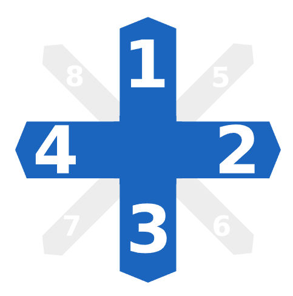

# Dave Adapter
Adapter to get values from analytics database for traffic analysis in DAVe. It runs periodically and adds new data to a defined DAVe instance.

## Concept

In traffic statistics possible directions on intersections needs to be addressable unambiguously. 

In [DAVe](https://opensource.muenchen.de/de/software/dave.html) directions are defined as shown in the following table. Top side is pointing north.

|DAVe directions| Mapping Example|
|-------|----------|
||<pre><code class="language-json">[<br>  {<br>    "observationAreaId": "9",<br>    "daveCountingId": "339f992e-0925-4f6d-9e75-099bc520ad2c",<br>    "intersectionMapping": {<br>        "dave-meckauer-nord" : "1",<br>        "dave-meckauer-ost" : "2",<br>        "dave-meckauer-sued" : "3",<br>        "dave-meckauer-west" : "4",<br>        "5" : "",<br>        "6" : "",<br>        "7" : "",<br>        "8" : ""<br>    }<br>  }<br>]</code></pre>|

Second column shows an example, how measurement identifiers are mapped to intersection legs in DAVe.

## How to Build

__Prerequisites__ 

* Java JDK 21 or later
* Maven 3
* PostgreSQL (available for development via docker-compose scripts)

See section [neccessary infra](#run-necessary-infra) for how to run necessary components with Docker Compose.

In order to run a local development environment execute the following steps.
__Please note__: all steps need to be executed from base folder of repositories.

1) build the project

    ```bash
    mvn clean install
    ```

2) start project

    ```bash
    java -jar target/dave-adapter-0.0.1-SNAPSHOT.jar
    ```

Once all steps ran successfully application will be reachable with the following coordinates:

* swagger under <http://localhost:8088/swagger-ui/>