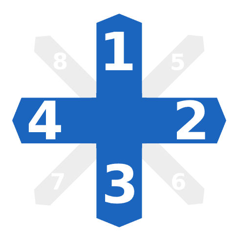

# Dave Adapter
Adapter to get values from Starwit's observatory analytics database for traffic analysis in DAVe. It runs periodically and adds new data to a defined DAVe instance.

## Concept

In traffic statistics possible directions on intersections needs to be addressable unambiguously. The following image shows the environment, in which DAVe adapter is running. It accesses via JDBC analytics DB which is part of Starwit's Observatory Stack to collect every 15 minutes latest count data.


Collected data are then mapped to DAVe format and send to detector interface.

### Mapping Concept
In [DAVe](https://opensource.muenchen.de/de/software/dave.html) directions are defined as shown in the following table. Top side is pointing north. Following image shows an example for a configured intersection counting. 



The for active directions can then be mapped like so:
```json
[
  {
    "observationAreaId": "9", //id for data source
    "daveCountingId": "339f992e-0925-4f6d-9e75-099bc520ad2c", //id in DAVe 
    //intersectionMappings are optional
    "intersectionMapping": {
        //map id strings to each activated intersection
        "N" : "1",
        "E" : "2",
        "S" : "3",
        "W" : "4",
        "NE": "5",
        "SE": "6",
        "SW": "7",
        "NW": "8"
    }
  }
]
```

In the example above, `N` is the compass direction of the light-barrier in observatory config which is mapped to the number of intersection-part - e.g. 1 for north. With `app.mapping=file:<<your-file-location>>` in the `application.properties`, you can define the location of your mapping file.

If you have a default mapping for all observation areas, you can set the json file with the property `app.mapping.intersection=file:<<your-file-location>>`. The file should look like this:

```json
{
  "N": "1",
  "E": "2",
  "S": "3",
  "W": "4",
  "NE": "5",
  "SE": "6",
  "SW": "7",
  "NW": "8"
}
```

The example above is in the classpath and will be used if no intersection mapping is given. 

## Configuration

Adapter is configured via [application.properties](src/main/resources/application.properties). Here are the central config items:

```properties
# data source for analytics data
spring.datasource.hikari.connection-timeout=10000
spring.datasource.url=${DB_URL:jdbc:postgresql://localhost:5432/analytics}
spring.datasource.username=${DB_USERNAME:analytics}
spring.datasource.password=${DB_PASSWORD:analytics}
spring.jpa.properties.hibernate.dialect=org.hibernate.dialect.PostgreSQLDialect

# how often shall data be transfered?
app.update_interval=15m
# lookup window to match 15 minute intervall
app.lookback_duration=1m
# DAVe endpoint
app.dave.url=http://localhost:8080/detector/save-latest-detections
# central mapping file
app.mapping=file:./sampleMapping.json
# if true adapter gets auth token for requests to DAVe 
app.auth.enabled=true

# Config to access protected DAVe instance
spring.security.oauth2.client.registration.daveclient.provider=daveprovider
spring.security.oauth2.client.registration.daveclient.client-id=client_id
spring.security.oauth2.client.registration.daveclient.client-secret=secret
spring.security.oauth2.client.registration.daveclient.authorization-grant-type=client_credentials
spring.security.oauth2.client.registration.daveclient.scope=openid, profile, email
spring.security.oauth2.client.provider.daveprovider.token-uri=https://uri
```

## How to Build

__Prerequisites__ 

* Java JDK 25 or later
* Maven 3

See section [neccessary infra](#run-necessary-infra) for how to run necessary components with Docker Compose.

In order to run a local development environment execute the following steps.
__Please note__: all steps need to be executed from base folder of repositories.

1) build the project

    ```bash
    mvn clean install
    ```

2) start project

    ```bash
    java -jar target/dave-adapter-0.0.1-SNAPSHOT.jar
    ```

Once all steps ran successfully application will be reachable with the following coordinates:

* swagger under <http://localhost:8088/swagger-ui/>

## Run necessary Infra

In order to develop adapter needs the following components:
* [Observatory/Analytics DB](https://github.com/starwit/observatory) - source data
* [DAVe Backend](https://github.com/starwit/dave-backend) - target environment

Optionally the following components are helpful for testing:
* [DAVe Frontend](https://github.com/starwit/dave-frontend) - display data
* [Observatory Config](https://github.com/starwit/observatory-config) - get active counting configurations
* [Starwit Awareness Engine/Valkey](https://github.com/starwit/starwit-awareness-engine) - get live counting data
* Keycloak - test authentication

### Database Query
In order to make development easier here is a sample query with actual values.

```sql
select
	count(r.object_id) as count,
	r.object_class_id as object_class_id,
	r.compass_dir_from as compass_dir_from,
	r.compass_dir_to as compass_dir_to
from (
	select
		observation_area_id,
		object_id,
		object_class_id,
		first_value(l.crossing_time) over w_time as min_time,
		last_value(l.crossing_time) over w_time as max_time,
		first_value(m.direction) over w_time as compass_dir_from,
		last_value(m.direction) over w_time as compass_dir_to,
		first_value(l.direction) over w_time as dir_from,
		last_value(l.direction) over w_time as dir_to,
		count(object_id) over w_time as idx
	from linecrossing l
		join metadata m on l.metadata_id = m.id
	where l.crossing_time >= '2026-09-16 07:00:00.000+00' and l.crossing_time <= '2026-09-16 07:15:00.000+00'
		and observation_area_id = 14
	window
		w_time as (partition by object_id order by l.crossing_time asc)
) r
where r.max_time >= '2026-09-16 06:55:00.000+00'
	and r.compass_dir_from <> r.compass_dir_to
	and r.dir_from = 'in' and r.dir_to = 'out'
group by r.object_class_id, r.compass_dir_from, r.compass_dir_to;
```

